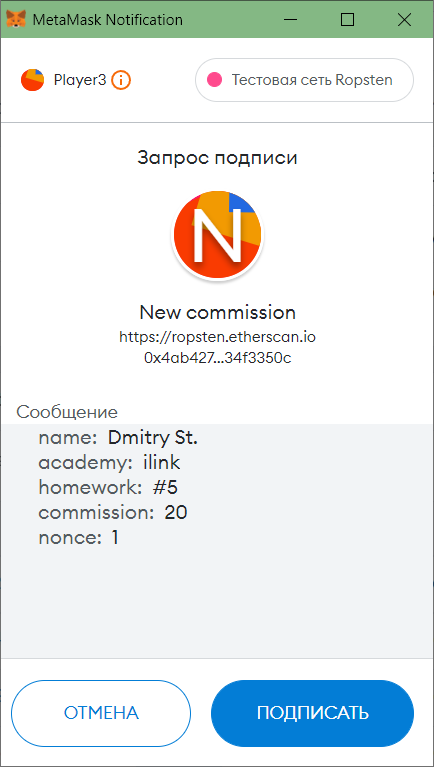

## ilink Academy. Домашняя работа #5. 

### Задача:  
Для чего и когда используем ECDSA.recover.
1. Подписать произвольное сообщение и проверить валидность подписи в контракте.  
Метод для подписания `eth_signTypedData_v4`, https://eips.ethereum.org/EIPS/eip-712
2. Проверка в контакте ECDSA.recover.  
3. Добавить в свой контракт этот метод, например, для изменения размера комиссии.  

### Реализация
Hardhat 2.9.1;  
Solidity 0.8.9;

### Решение  
Сообщение для подписи выглядит следующим образом:
```typescript
const msg = JSON.stringify({
    types: {
        EIP712Domain: [
            { name: 'name', type: 'string' },
            { name: 'version', type: 'string' },
            { name: 'chainId', type: 'uint256' },
            { name: 'verifyingContract', type: 'address' },
        ],
        Permit: [
            { name: 'name', type: 'string' },
            { name: 'academy', type: 'string' },
            { name: 'homework', type: 'string' },
            { name: 'commission', type: 'uint256' },
            { name: "nonce", type: "uint256" },
        ],
    },
    primaryType: 'Permit',
    domain: {
        name: 'New commission',
        version: '1',
        chainId: 42,
        verifyingContract: '0x30A45aC01C12730AEb3226831b30500841e713Bb',
    },
    message: {
        "name": "Dmitry St.",
        "academy": "ilink",
        "homework": "#5",
        "commission": 5,
        "nonce": 0,
    },
});
```
Основная логика описана в [ДЗ №4](https://github.com/PushinSt/TicTacToe-ilink-hm4).  
Решение данного ДЗ состоит из:  
1. Установка новой комиссии с помощью подписанного сообщения  
`function newCommission(uint8 _commision, bytes memory _sig, uint256 _nonce) external`  
_commision - Новая комиссия, _sig - сигнатура с подписанного сообщения, _nonce - одноразовый номер (защита от повторного входа).  
Используется библиотека ECDSA.sol и собственная реализация проверки

```solidity
        function newCommission(
        uint8 _commision,
        bytes memory _sig,
        uint256 _nonce
    ) external {
        require(_commision >= 0 && _commision <= 100, "Commision is not correct");
        require((nonce == _nonce), "Nonce is different");

        Permit memory mess = Permit("Dmitry St.", "ilink", "#5", _commision, _nonce); // Forming the message(Permit)

        require(checkSign(mess, _sig), "Signature does not match request"); // Validation using your own implementation
        require(checkSignECDSA(mess, _sig), "Signature does not match request"); // Validation using the library ECDSA.sol

        nonce = _nonce + 1; // Protection of reusing sign
        commission = _commision;
        emit SetCommission(_commision);
    }
```


2. Проверка подписи сообщения с помощью библиотеки ECDSA (приватная функция)  
`function checkSignECDSA(Permit memory mess, bytes memory sig) private view returns (bool)`  
mess - permit сообщение, sig - сигнатура с подписанного сообщения.  

```solidity
function checkSignECDSA(Permit memory mess, bytes memory sig) private view returns (bool) {
        uint256 _chainId;
        assembly {
            _chainId := chainid() // Defining the chain
        }
        bytes32 DOMAIN_SEPARATOR = hash(EIP712Domain({name: "New commission", version: "1", chainId: _chainId, verifyingContract: address(this)}));

        bytes32 digest = keccak256(abi.encodePacked("\x19\x01", DOMAIN_SEPARATOR, hash(mess)));

        return ((ECDSA.recover(digest, sig) == signer)); // Check he message owner's address
    }
```


3. Проверка подписи сообщения (приватная функция)  
`function checkSign(Permit memory mess, bytes memory sig) private view returns (bool)`  
mess - permit сообщение, sig - сигнатура с подписанного сообщения.  

```solidity
    function checkSign(Permit memory mess, bytes memory sig) private view returns (bool) {
        uint256 _chainId;
        uint8 v;
        bytes32 r;
        bytes32 s;

        assembly {
            _chainId := chainid() // Defining the chain

            // first 32 bytes, after the length prefix
            r := mload(add(sig, 32))
            // second 32 bytes
            s := mload(add(sig, 64))
            // final byte (first byte of the next 32 bytes)
            v := byte(0, mload(add(sig, 96)))
        }

        bytes32 DOMAIN_SEPARATOR = hash(
            EIP712Domain({
                name: "New commission",
                version: "1",
                chainId: _chainId,
                verifyingContract: address(this)
            })
        );

        bytes32 digest = keccak256(abi.encodePacked("\x19\x01", DOMAIN_SEPARATOR, hash(mess)));
        return ((ecrecover(digest, v, r, s) == signer)); // Проверка "подписанта"
    }
```
   
4. Взятие хэша от домена (от сообщения permit) (приватная функция)
`function hash(EIP712Domain memory eip712Domain) private pure returns (bytes32)`  
`function hash(Permit memory mess) private pure returns (bytes32)`  
eip712Domain - домен, mess - permit сообщение.  

```solidity
    function hash(EIP712Domain memory eip712Domain) private pure returns (bytes32) {
        return keccak256(abi.encode(EIP712DOMAIN_TYPEHASH, keccak256(bytes(eip712Domain.name)), keccak256(bytes(eip712Domain.version)), eip712Domain.chainId, eip712Domain.verifyingContract));
    }
    
    function hash(Permit memory mess) private pure returns (bytes32) {
        return keccak256(abi.encode(MAIL_TYPEHASH, keccak256(bytes(mess.name)), keccak256(bytes(mess.academy)), keccak256(bytes(mess.homework)), mess.commission, mess.nonce));
    }
```

5. Изменение адреса, с которого осуществляется подпись сообщений  
`function setSigner(address _signer) external onlyOwner`  
_signer - Адрес нового "владельца подписи".  

```solidity
    function setSigner(address _signer) external onlyOwner {
        require(_signer != address(0), "signer is not correct");
        signer = _signer;
    }
```

#### Задачи для cli hardhat (sign)
Смарт контракт размещался в тестовой сети.  
Основные задачи описаны в [ДЗ №4](https://github.com/PushinSt/TicTacToe-ilink-hm4).  
1. Подписать новое сообщение для изменения комиссии:  
`npx hardhat new-sign --network $network --address $address --commission $commission --nonce $nonce --signer $signer`  
$network - сеть для выполнения задачи, $address - адрес Proxy контракта, $commission - новый размер комиссии, $nonce - одноразовый номер для защиты от повторного входа, $signer - владелец подписи (порядковый номер счета из mnemonic). 

2. Установка новой комиссии с помощью подписанного сообщения:  
`npx hardhat new-commission-sign --network $network --address $address --commission $commission --nonce $nonce --sign $sign`  
$network - сеть для выполнения задачи, $address - адрес Proxy контракта, $commission - новый размер комиссии, $nonce - одноразовый номер для защиты от повторного входа, $sign - сигнатура с подписанного сообщения.

3. Изменение адреса, с которого осуществляется подпись сообщения:  
`npx hardhat set-sign --network $network --address $address --signer $signer`  
$network - сеть для выполнения задачи, $address - адрес Proxy контракта, $signer - новый "владелец подписи" (порядковый номер счета из mnemonic). 

#### Тестирование
Автоматизированные тесты (Подпись сообщений) описаны в файле tests\signature.test.ts и запускаются командой:  
`npx hardhat test tests\signature.test.ts`  

Основные автоматизированные тесты находятся в папке test и запускаются командой:  
`npx hardhat test`  

Анализ расхода газа можно включить с помощью ключа GAS_REPORT:


#### Проверка и публикация исходного кода контракта
Команда для публикации контрактов в тестовой сети ropsten:  

Публикация осуществлялась с помощью библиотечного прокси OpenZeppelinTransparentProxy  

Для публикации контракта:   
`npx hardhat deploy --network ropsten --tags TicTacToe`  

Команда для верификации контракта в сети ropsten:  
`npx hardhat --network ropsten etherscan-verify --solc-input --contract-name TicTacToe_Implementation`  

Адрес смарт контракта TicTacToe в тестовой сети ropsten: [0x767BeD2107a794D1c0c2B6dD568E1549c7f3a392](https://ropsten.etherscan.io/address/0x767BeD2107a794D1c0c2B6dD568E1549c7f3a392)  
Адрес смарт контракта Proxy в тестовой сети ropsten: [0xBc670697F57F12A8A510011c1d0b929b8a294015](https://ropsten.etherscan.io/address/0xBc670697F57F12A8A510011c1d0b929b8a294015) 

##### Демонстрация подписи сообщения  

0. Установка адреса "владельца подписи"
`set-sign --signer 1`  

1. Выдача текущего размера комиссии   
`BigNumber { value: "10" }`  

2. Подпись сообщения (новая комиссия 5%)  
`new-sign: --commission 5 --nonce 0 --signer 1`  
  
```
Signature: 0x8f47f3f301a93f9d0acfa99a616f48b0978634692937a54ec6f4a01854eb3ec9641d38b148b517481920449d7c04ee3b18f1b9fb246f7e00485d8a970705f33e1c
v: 28
r: 0x8f47f3f301a93f9d0acfa99a616f48b0978634692937a54ec6f4a01854eb3ec9
s: 0x641d38b148b517481920449d7c04ee3b18f1b9fb246f7e00485d8a970705f33e
```
3. Смена размера комиссии    
```
new-commission-sign:
--commission 5 
--nonce 0 
--sign 0x8f47f3f301a93f9d0acfa99a616f48b0978634692937a54ec6f4a01854eb3ec9641d38b148b517481920449d7c04ee3b18f1b9fb246f7e00485d8a970705f33e1c
```   

4. Выдача текущего размера комиссии    
`BigNumber { value: "5" }`  

5. Подпись сообщения (новая комиссия 20%)  
`new-sign: --commission 20 --nonce 1 --signer 1`  
  
```
Signature: 0x03fca757e2c75b43e7126caaf8cb687d1c7ab8fe57dd3370860ed224f8944d425e9d18dd7ea51c276d0a042501afb97f071ec8c278ccda0480deb0762f73a7601c
v: 28
r: 0x03fca757e2c75b43e7126caaf8cb687d1c7ab8fe57dd3370860ed224f8944d42
s: 0x5e9d18dd7ea51c276d0a042501afb97f071ec8c278ccda0480deb0762f73a760
```

6. Смена размера комиссии    
```
new-commission-sign: 
--commission 20 
--nonce 1 
--sign 0x03fca757e2c75b43e7126caaf8cb687d1c7ab8fe57dd3370860ed224f8944d425e9d18dd7ea51c276d0a042501afb97f071ec8c278ccda0480deb0762f73a7601c
```  

7. Выдача текущего размера комиссии    
`BigNumber { value: "20" }`  
